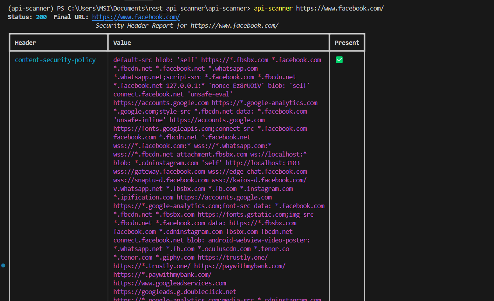

# API Security Scanner

An open-source DAST tool that scans your APIs for common security
vulnerabilities based on the OWASP API Security Top 10.

Detect and fix weaknesses in your APIs before attackers find them.



## Features
- Missing authentication detection
- BOLA / IDOR testing
- Security header checks
- JSON and HTML reports

## Installation
    pip install -r requirements.txt

## Usage
    python -m scanner.cli scan openapi.yaml --token YOUR_TOKEN

## Disclaimer
Only scan APIs you own or have written permission to test.

## License
MIT

## Features
- Performs GET requests (following redirects) to each supplied URL.
- Reports presence of common security headers (CSP, HSTS, X‑Content‑Type‑Options, etc.).
- Displays results in a nicely formatted table using **rich**.
- Simple command‑line interface powered by **typer**.

## Installation
```bash
# Clone the repository (if you haven't already)
git clone https://github.com/Jaex10x/api_security_scanner.git
cd api_security_scanner/api-scanner

# Create a virtual environment (optional but recommended)
python -m venv .venv
.venv\Scripts\activate  # on Windows

# Install the package in editable mode
pip install -e .
```

The required dependencies (`httpx`, `rich`, `typer`, etc.) are declared in **pyproject.toml** and will be installed automatically.

## Usage
```bash
# Scan a single URL
api-scanner https://example.com

# Scan multiple URLs
api-scanner https://example.com https://api.example.org
```

The CLI will output the HTTP status code, the final URL after redirects, and a table indicating which security headers are present.

## Development
Run the tests (once added) with:
```bash
pytest
```

Feel free to extend the scanner with additional checks (e.g., authentication methods, OpenAPI spec analysis, etc.).

## License
MIT – see the LICENSE file for details.
